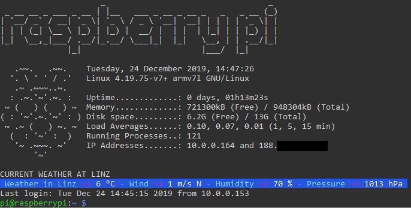

# Message of the day (MOTD)

On my raspberry pi I'm using my custom motd which shows me some stats of the system when I connect via ssh to my user.

Custom motd files can have different locations, depending on the system you use. On my raspberry pi running Raspian 10 Buster the corresponding folder is in `/etc/update-motd.d`

All script files contained in this folder will be concatenated by an automatic script operated by the OS itself which adds them up in lexicographical order. Therefore each script has a starting digit which indicates which script is added first and so on.

A detailed description can be found [here](https://ownyourbits.com/2017/04/05/customize-your-motd-login-message-in-debian-and-ubuntu/) and [here](https://wiki.ubuntu.com/UpdateMotd).

## What the provided scripts do
* 00-header  
Simply prints a word using figlet. I use this to identify my machines which may be useful if you have several terminals opened.

* 05-sysinfo  
Prints the actual date, kernel version, uptime, memory space, disk space, load averages, running processes and internal and external ip address.

* 10-weather  
Prints the actual weather for your desired city which is provided via the option `-l` to `ansiweather`.

When implementing this on your own, make sure your scripts are marked as executable, otherwise they won't take effect.

Enjoy!